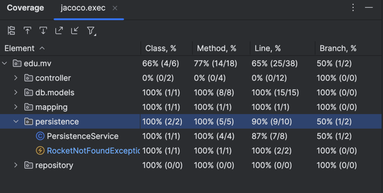
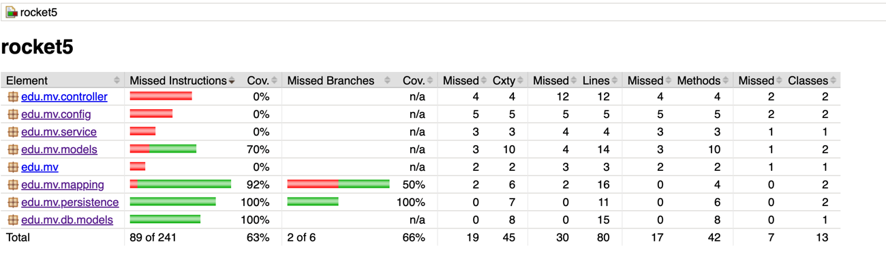
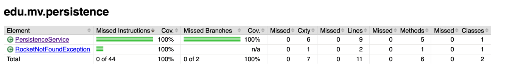
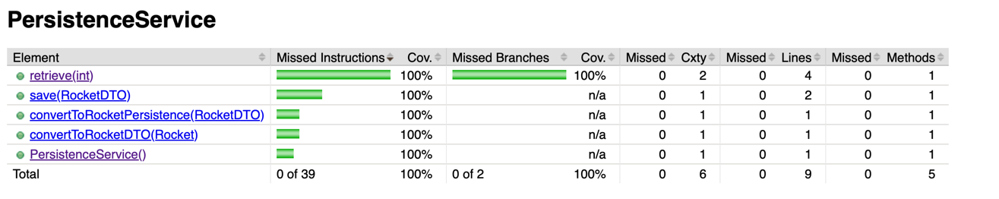

# Jenkins Pipeline for CI/CD using K8S for deployment

## To build
    mvn clean install

## To start Spring Boot project
    mvn spring-boot:run

# Operation on the Rocket API

1. GET /rocket/{rocketid}

2. POST /rocket
    voir /test/resources/rocket.json
   
# Coverage

## Coverage in Intellij

## Coverage in web

## Versions
- Java 17

## Dependencies
- Spring 6.1.11
- SpringBoot 3.3.3
- Mockito 5.12.0
- Jakarta Servlet 6.0.0
- JUnit5 Jupyter API 5.10.2
- MapStruct 1.6.0
- H2

## Maven plugins
- Jacoco 0.8.12
- Maven Surefire 3.2.5
